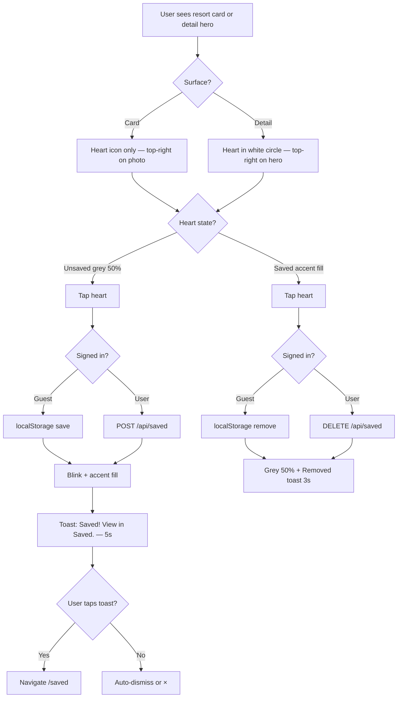

# Story 10.3: Save Resort Heart — Guest & Authenticated

Status: ready-for-dev

<!-- PO additions 2026-07-09 — heart placement, visual states, save/unsave toast notifications (AuthSuccessToast pattern) -->
<!-- PO follow-up 2026-07-09 — accent active color; card vs detail chrome; save toast 5s + link to /saved -->

## Story

As a **visitor**,
I want to heart resorts from cards and detail pages,
So that I can shortlist resorts for later.

**Source shard(s):** [`epics/phase2/shards/epic-10-nav-saved.md`](../../planning-artifacts/epics/phase2/shards/epic-10-nav-saved.md) · [`prds/phase2/shards/11-features-saved-resorts.md`](../../planning-artifacts/prds/phase2/shards/11-features-saved-resorts.md) — see `_powri/planning-artifacts/INDEX.md` before re-reading source docs.

**Depends on:** Story **10.1** (nav + stub `/saved` route), Story **9.2** (Supabase session for authenticated saves)

**Out of scope (Story 10.4):** `/saved` list population, guest sync banner, `POST /api/saved/merge` on login, `saved_list_viewed` analytics.

---

## Acceptance Criteria

### A. Placement & surfaces — epic baseline + PO

1. **Given** a resort card (Explore, Home list, quiz results, etc.)  
   **When** the card renders  
   **Then** a heart control appears as a **top-right overlay on the resort photo** (not in the text body below the image)

2. **Given** a resort detail page  
   **When** the hero renders  
   **Then** the same heart control appears **top-right on the hero image**, below safe area — **not** overlapping the overlay back button (back stays top-left)

3. **And** heart tap **does not** navigate to the resort detail (card: `stopPropagation` / separate control outside the card `<Link>`)

4. **And** 44×44px minimum tap target on both surfaces (`ux-phase2/design.md` SaveHeart spec)

### B. Surface-specific chrome — PO follow-up (2026-07-09)

5. **Given** a **resort card**  
   **When** the heart renders  
   **Then** it is **heart icon only** — **no** circular white backdrop behind the icon

6. **Given** a **resort detail hero**  
   **When** the heart renders  
   **Then** it sits inside a **semi-opaque white circular backdrop** (`bg-surface/90` or equivalent, `rounded-pill`) overlayed **top-right on the hero image**  
   **And** the heart icon is centred in that circle

7. **And** saved/unsaved **icon colors and fill states are identical** on card and detail — only the detail surface adds the circular chrome

### C. Visual states — PO additions (2026-07-09)

8. **Given** a resort is **not** saved  
   **When** I view the heart (card or detail)  
   **Then** it shows a **filled heart icon** in **theme grey at ~50% opacity** so it is obvious the resort is unsaved and tappable  
   **And** the grey derives from existing tokens (e.g. `--color-text-secondary` / `text-text-secondary` at 50% opacity) — no off-palette hex

9. **Given** I tap heart to **save**  
   **When** the save succeeds  
   **Then** the heart **blinks briefly** (scale pulse, ~150ms — match UX SaveHeart toggle animation) and transitions to the **saved / active fill color** `--color-accent` (`#2D6BE4`, `text-accent`) per [`ux-phase2/design.md`](../../planning-artifacts/ux-designs/ux-phase2/design.md) SaveHeart spec

10. **Given** a resort **is** saved  
    **When** I view the heart on card or detail  
    **Then** active state is **consistent** on both surfaces for the same `resort_slug` (accent fill; detail retains circular backdrop)

11. **Given** I tap heart to **unsave**  
    **When** the unsave succeeds  
    **Then** heart returns to the unsaved grey 50% state (with optional brief blink on toggle)

### D. Save / unsave feedback toasts — PO additions (2026-07-09)

12. **Given** I successfully **save** a resort  
    **When** the toggle completes  
    **Then** a top-of-page notification appears with copy **"Saved! View in Saved."** (`saved.saveToast`)  
    **And** animation matches **Sign-in successfully** toast from Story 9.11: **slide down on enter**, **ease up on exit**, manually dismissible via ×, `role="status"` + `aria-live="polite"`, respects `prefers-reduced-motion`  
    **And** auto-dismiss after **5 seconds** (longer than sign-in toast’s 3s)  
    **And** **tapping the toast body** (not the × dismiss) navigates to **`/saved`** and dismisses the toast  
    **And** toast body uses pointer cursor / link affordance; "View in Saved." may use `text-accent` for emphasis

13. **Given** I successfully **unsave** a resort  
    **When** the toggle completes  
    **Then** a top-of-page notification appears with copy **"Removed from saved resorts"** (`saved.unsaveToast`)  
    **And** same enter/exit animation and a11y as AC 12  
    **And** auto-dismiss after **3 seconds** (same as sign-in toast); **not** clickable / no navigation

14. **And** toast stacking: if a toast is already visible, replace or queue so only one save-feedback toast shows at a time (no overlapping banners)

### E. Guest persistence — epic / PRD FR-15.1

15. **Given** I am a **guest** (not signed in)  
    **When** I tap heart to save  
    **Then** `resort_slug` is appended to `localStorage` key **`powri_saved_resorts`** (array of slug strings; dedupe on write)

16. **When** I tap heart to unsave as guest  
    **Then** slug is removed from that array

17. **And** guest saves survive page refresh on the same device/browser

### F. Authenticated persistence — epic / architecture

18. **Given** I am **signed in**  
    **When** I tap heart to save  
    **Then** `POST /api/saved` persists `{ resort_slug }` to `saved_resorts` table (`user_id`, `resort_slug`, `saved_at`)

19. **When** I tap heart to unsave while signed in  
    **Then** `DELETE /api/saved` removes the row for that slug

20. **Given** I am signed in on mount  
    **When** saved state is needed (heart on visible card/detail)  
    **Then** client loads saved slugs via `GET /api/saved` (or a shared provider seeded once per session) so hearts reflect DB state after refresh

21. **And** authenticated toggle uses **optimistic UI** with rollback + user-visible error if API fails (no false “Saved” toast on failure)

### G. Analytics — FR-15.1 / tracking plan

22. **And** `resort_saved` fires on save with `resort_slug`, `surface` (`card` | `detail`), `is_logged_in`

23. **And** `resort_unsaved` fires on unsave with same properties

24. **And** events registered in `phase2Events.ts` instrumentation files list after implementation

### H. Accessibility & regression

25. **And** heart button has accessible name reflecting state (e.g. “Save Niseko United” / “Remove Niseko United from saved resorts”)

26. **And** save toast tap target has accessible name (e.g. “Saved! View saved resorts.”) — not only visual link styling

27. **And** no invalid HTML nesting (`<button>` inside `<a>`) on resort cards or save toast

28. **And** Unsplash attribution strip on cards remains usable; heart z-index above image, does not block attribution links

---

## PO decisions (resolved 2026-07-09)

| Topic | Decision |
|-------|----------|
| Saved heart color | **`--color-accent` `#2D6BE4`** — UX spec Option A; no new token |
| Unsave toast copy | **"Removed from saved resorts"** (`saved.unsaveToast`) |
| Save toast copy | **"Saved! View in Saved."** (`saved.saveToast`) |
| Save toast duration | **5s** auto-dismiss (vs 3s sign-in / unsave) |
| Save toast action | Tap toast body → navigate **`/saved`** |
| Card heart chrome | **Icon only** — no circular backdrop |
| Detail heart chrome | **Heart + white circular backdrop**, top-right on hero image |

### Toast implementation

Extract shared **`TopToast`** (or `FeedbackToast`) from `AuthSuccessToast` — same CSS module enter/exit keyframes, configurable `durationMs`, optional `href` / `onAction` for save toast navigation. Refactor `AuthSuccessToast` to use the shared primitive (no behavior change for sign-in).

---

## User journey



**Card:** Heart icon only on `aspect-[16/10]` image — `absolute top-2.5 right-2.5`, outside card `<Link>`, `stopPropagation`.

**Detail:** Same heart states inside **44×44px** (or larger) circular `bg-surface/90 rounded-pill` control, `absolute top-right` on hero below safe area. Back button stays fixed top-left (`OverlayBackButton`, `z-[45]`).

---

## Testing & Definition of Done

Per [`docs/process/testing-strategy.md`](../../../docs/process/testing-strategy.md).

- [ ] **Unit (Vitest):** `web/src/lib/saved/localStorage.ts` — read/write/dedupe/toggle; API route handlers (`/api/saved` GET/POST/DELETE); optimistic rollback helper if extracted
- [ ] **Quiz / scoring:** N/A
- [ ] **Analytics:** Update `docs/analytics/tracking-plan.md` if needed + `phase2Events.ts` instrumentation paths + `npm run test:analytics`
- [ ] **Content / resorts:** N/A
- [ ] **User-facing flow:** Playwright note — heart on card (no backdrop) + detail (with backdrop); save toast tap → `/saved`; guest localStorage persists (optional in 10.3, required before epic sign-off)
- [ ] **Manual QA:** 375px + 1024px — card icon-only vs detail circular chrome; accent saved fill; save toast 5s + navigation; unsave toast 3s; no overlap with back button

**Pre-merge from `web/`:** `npm run lint && npm run build && npm run test:unit && npm run test:analytics`

---

## Tasks / Subtasks

- [ ] **Lib — guest storage** (AC: 15–17)
  - [ ] `web/src/lib/saved/localStorage.ts` — `getSavedSlugs`, `saveSlug`, `unsaveSlug`, `isSaved`; key `powri_saved_resorts`
  - [ ] Unit tests `localStorage.test.ts`
- [ ] **API — authenticated saves** (AC: 18–21)
  - [ ] `web/src/app/api/saved/route.ts` — GET list, POST save, DELETE unsave; `requireUser`; RLS via user-scoped Supabase client
  - [ ] Route tests (401 guest, happy path, idempotent save, delete missing)
- [ ] **Client state** (AC: 10, 20)
  - [ ] `SavedResortsProvider` + `useSavedResorts` — guest localStorage vs `GET /api/saved`; `isSaved(slug)`, `toggleSave(slug, surface)`
- [ ] **UI — SaveHeart** (AC: 1–11, 25–28)
  - [ ] `SaveHeart.tsx` + CSS module blink; prop `variant: 'card' | 'detail'` — card = icon only; detail = icon + circular backdrop
  - [ ] Wire into `ResortCard.tsx` (`variant="card"`)
  - [ ] Wire into `ResortDetailHero.tsx` or wrapper (`variant="detail"`)
- [ ] **UI — feedback toast** (AC: 12–14)
  - [ ] Extract shared `TopToast` from `AuthSuccessToast`; support `durationMs` (5000 save / 3000 unsave), optional `href="/saved"` on save toast
  - [ ] Refactor `AuthSuccessToast` to use `TopToast` (3s unchanged)
  - [ ] Trigger save/unsave toasts from provider/hook on success
- [ ] **Analytics** (AC: 22–24)
  - [ ] Fire `resort_saved` / `resort_unsaved` with required props
  - [ ] Update `phase2Events.ts` instrumentation file paths
- [ ] **i18n** (AC: 12–13, 25–26)
  - [ ] `saved.saveToast`: "Saved! View in Saved."; `saved.unsaveToast`; heart + save-toast aria labels
- [ ] **Provider wiring**
  - [ ] Wrap app in `SavedResortsProvider` (inside `AuthProvider` in root layout)

---

## Dev Notes

### Reuse — do not reinvent

| Pattern | Location | Use for |
|---------|----------|---------|
| Sign-in success toast | `AuthSuccessToast.tsx` + `.module.css` | Extract shared `TopToast`; save toast 5s + `/saved` link; unsave 3s |
| API auth guard | `web/src/lib/auth/requireUser.ts` | `/api/saved` routes |
| API response helpers | `web/src/lib/api/errors.ts` | Consistent JSON errors |
| Supabase server client | `web/src/lib/supabase/server.ts` | DB reads/writes |
| Lucide icon | `Heart` from `lucide-react` | Filled via `fill="currentColor"` + stroke |
| Card image container | `ResortCard.tsx` `aspect-[16/10]` | Heart overlay anchor |
| Detail hero | `ResortDetailHero.tsx` | Heart overlay anchor |
| DB schema | `supabase/migrations/001_phase2_core.sql` `saved_resorts` | Already deployed in Epic 9 |

### Current file state (read before editing)

**`ResortCard.tsx`** — Card is a single `<Link>` wrapping image + body. Heart must be **outside** the link or use an isolated `<button>` with `e.preventDefault()` / `stopPropagation` on the image stack. Image area already has Unsplash attribution overlay at bottom (`z-10`).

**`ResortDetailHero.tsx`** — Server component; hero has bottom-aligned title block. Add client `SaveHeart variant="detail"` as absolute top-right child with circular backdrop. Page already renders `ResortDetailOverlayBack` (fixed top-left).

**`SaveHeart` variants:**

| `variant` | Chrome | Placement |
|-----------|--------|-----------|
| `card` | Heart icon only | Top-right on card photo |
| `detail` | Heart in `bg-surface/90 rounded-pill` circle | Top-right on detail hero image |

**`/saved` page** — Stub only (`placeholderBody`); **do not** implement list in this story.

**`/api/saved`** — **Does not exist yet**; create in this story. **`/api/saved/merge`** — Story 10.4.

### localStorage shape

```ts
// key: powri_saved_resorts
// value: JSON stringified string[]
// example: ["niseko-united","hakuba-valley"]
// Order: append on save (most recent last) — 10.4 sort uses saved_at from DB; guest order preserved for merge
```

### API contract (suggested — align with existing route patterns)

```
GET  /api/saved        → 200 { slugs: string[] }  | 401
POST /api/saved        → 201 { resort_slug }      body: { resort_slug: string }  | 401 | 400
DELETE /api/saved      → 200                       body: { resort_slug: string }  | 401 | 404
```

Use upsert / `on conflict do nothing` on POST for idempotency.

### SavedResortsProvider behavior

1. On mount: if guest → read localStorage; if authed → fetch GET `/api/saved`
2. On auth transition guest→user: **defer merge to 10.4**; for 10.3, after sign-in refresh from GET `/api/saved` only (guest local saves still in localStorage until 10.4 merge)
3. `toggleSave`: update local state optimistically → persist → show toast → analytics; revert on error

### Toast durations & navigation

| Toast | Copy | Duration | Tap action |
|-------|------|----------|------------|
| Save | "Saved! View in Saved." | **5000ms** | Navigate `/saved` (use `router.push` or `Link`-styled button; dismiss on navigate) |
| Unsave | "Removed from saved resorts" | **3000ms** | None |
| Sign-in (existing) | "Signed in successfully" | 3000ms | None |

Implement save toast body as a single `<button type="button">` or `<a href="/saved">` wrapping the message; keep × dismiss separate so it does not trigger navigation.

### Heart animation (CSS)

- **Blink on toggle:** `@keyframes heartBlink` — scale 1 → 1.2 → 1 over ~150ms (`ease-out`)
- **Reduced motion:** skip blink; instant color change (match `AuthSuccessToast` pattern)

### Z-index stack

| Layer | z-index |
|-------|---------|
| Overlay back | 45 |
| Save feedback toast | 70 |
| Heart on card/hero | 20 (above image, below global toast) |

### Cross-story boundaries

| Story | Owns |
|-------|------|
| **10.3 (this)** | Heart UI, guest localStorage, `/api/saved` CRUD, save toasts, analytics save/unsave |
| **10.4** | `/saved` list UI, sync banner, `POST /api/saved/merge`, `saved_list_viewed`, sort by `saved_at` |

### Previous story intelligence (10.2)

- Page title alignment / no eyebrows — heart does not add page headers
- Invalid nesting guard — heart button must not sit inside card `<Link>`
- E2E: run against fresh dev server (`10-2-2` lesson on stale server false failures)

### Project Structure Notes

- New: `web/src/components/saved/SaveHeart.tsx`
- New: `web/src/lib/saved/localStorage.ts`
- New: `web/src/app/api/saved/route.ts`
- Update: `ResortCard.tsx`, `ResortDetailHero.tsx` (or detail page client wrapper)
- New: `web/src/components/ui/TopToast.tsx` (shared; refactor `AuthSuccessToast` to consume it)

### References

- [Source: `_powri/planning-artifacts/prds/phase2/shards/11-features-saved-resorts.md` — FR-15.1]
- [Source: `_powri/planning-artifacts/epics/phase2/epics-phase2.md` — Story 10.3 AC]
- [Source: `_powri/planning-artifacts/architecture/phase2/architecture-phase2.md` — §3.1 dual storage, §6.1–6.3 saved modules]
- [Source: `_powri/planning-artifacts/ux-designs/ux-phase2/design.md` — SaveHeart component]
- [Source: `_powri/planning-artifacts/ux-designs/ux-phase2/mockups/key-saved.html` — heart placement on card image]
- [Source: `_powri/implementation-artifacts/9-11-bug-post-signin-redirect-no-confirmation.md` — toast behavior]
- [Source: `docs/analytics/tracking-plan.md` — `resort_saved`, `resort_unsaved`]
- [Source: `web/src/styles/tokens.css` — theme colors]

---

## Dev Agent Record

### Agent Model Used

Composer

### Debug Log References

### Completion Notes List

### File List

### Change Log

- 2026-07-09: Story created with PO heart UI/toast requirements (create-story 10.3).
- 2026-07-09: PO resolved accent active color; card vs detail chrome; save toast 5s + `/saved` navigation; unsave copy confirmed.
